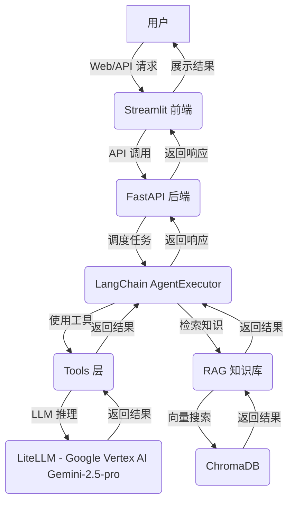

# AI求职助手Agent - 详细技术架构文档

## 1. 系统概述与目标

AI求职助手Agent旨在通过集成LLM、RAG和多种工具，为求职者提供智能化的求职服务。核心目标是自动化职位分析、简历匹配、求职信生成和模拟面试，从而提高求职效率和成功率。

## 2. 整体系统架构图



**组件说明：**
- **用户 (User)**: 最终用户，通过前端界面或直接API与系统交互。
- **Streamlit 前端 (Streamlit Frontend)**: 提供图形用户界面，负责用户输入（简历、JD）、功能选择和结果展示。
- **FastAPI 后端 (FastAPI Backend)**: 作为系统的API网关，处理所有外部请求，将请求路由到Agent层，并返回响应。
- **LangChain AgentExecutor**: 系统的核心大脑，基于LangChain框架实现。它采用ReAct（Reasoning and Acting）范式，能够根据用户输入和可用工具进行推理、规划和执行。
- **Tools 层 (Tools Layer)**: 封装了Agent可以调用的具体功能，如 `analyze_jd`、`match_resume` 等。这些工具内部可能调用LLM或RAG模块。
- **RAG 知识库 (RAG Knowledge Base)**: 负责检索增强生成。它管理与向量数据库的交互，将相关文档片段检索出来，作为上下文提供给LLM。
- **ChromaDB**: 开源的向量数据库，用于存储和检索简历、JD等文档的嵌入向量。
- **LiteLLM - Google Vertex AI Gemini-2.5-pro**: 核心大型语言模型，负责理解用户意图、执行工具逻辑、生成文本（如匹配分析、求职信草稿）等。LiteLLM 提供了统一的API接口，此处配置为直接调用 Google Vertex AI 上的 Gemini-2.5-pro 模型。

## 3. 数据流图

```mermaid
graph TD
    A[用户上传简历/JD] -->|文件/文本| B(Streamlit 前端)
    B -->|POST /upload-resume /analyze-jd| C(FastAPI 后端)
    C -->|调用 Agent.run()| D(LangChain AgentExecutor)
    D -->|Tool: analyze_jd| E(tools.py)
    E -->|LLM: analyze_jd_chain| G(LiteLLM)
    G -->|返回结构化JD数据| E
    E -->|Tool: match_resume| E1(tools.py)
    E1 -->|RAG: 检索相关简历/JD| F(rag.py)
    F -->|向量化查询| H(ChromaDB)
    H -->|返回Top-K文档| F
    F -->|传递上下文给LLM| G1(LiteLLM)
    G1 -->|返回匹配结果| E1
    E1 -->|返回结果| D
    D -->|返回最终响应| C
    C -->|JSON响应| B
    B -->|展示给用户| A
```

**关键数据流：**
1.  **用户输入**: 用户通过 Streamlit 界面上传简历文件（PDF）或粘贴文本，并粘贴JD文本。
2.  **API 网关**: Streamlit 将用户输入通过特定的API端点（如 `/upload-resume` 或 `/analyze-jd`）发送到 FastAPI 后端。
3.  **Agent 调度**: FastAPI 后端接收到请求后，将其转发给 LangChain AgentExecutor。Agent 根据用户意图决定调用哪个工具。
4.  **工具执行**:
    *   **`analyze_jd`**: 当Agent决定分析JD时，`analyze_jd` 工具被调用。它将JD文本传递给LLM，LLM根据预定义的Pydantic模型提取结构化信息并返回。
    *   **`match_resume`**: 当Agent决定匹配简历时，`match_resume` 工具被调用。它首先利用RAG模块检索与当前JD或简历最相关的其他简历/JD（存储在ChromaDB中）。然后，将这些上下文信息与JD和简历文本一起传递给LLM，LLM生成匹配分数、优势、劣势和建议。
5.  **RAG 流程**: `rag.py` 模块负责管理文档的向量化、存储和检索。当需要上下文信息时，它向ChromaDB发起向量相似度搜索，并将检索到的文档片段（通常是经过处理的文本块）返回。
6.  **LLM 交互**: 所有需要高级语言理解和生成能力的任务都通过 `LiteLLM` 调用 Google Vertex AI 上的 `Gemini-2.5-pro` 模型完成。 `tools.py` 和 `rag.py` 内部都与LLM进行交互。
7.  **结果返回**: 工具将处理结果返回给 Agent，Agent进行最终整合，FastAPI将JSON响应返回给前端，前端进行展示。

## 4. Agent 决策流程

LangChain AgentExecutor 采用 ReAct (Reasoning and Acting) 范式，其核心流程如下：

1.  **Observation (观察)**: Agent 接收用户输入（即Prompt），以及可选的聊天历史。
2.  **Thought (思考)**: Agent 根据Observation和其内部的推理能力（通常由LLM驱动），生成一个“思考”步骤。这个思考会规划下一步的行动，例如“我需要分析JD，所以应该使用 `analyze_jd` 工具”。
3.  **Action (行动)**: Agent 根据Thought决定调用哪个工具，以及该工具所需的参数。
4.  **Action Output (行动输出)**: 被调用的工具执行其逻辑，并将结果返回给Agent。

这个循环会持续进行，直到Agent认为已经完成任务并生成最终的响应。

## 5. RAG 检索流程

1.  **文档加载**: 从文件系统（如PDF、TXT）加载原始简历和JD文档。
2.  **文本分块**: 使用 `RecursiveCharacterTextSplitter` 将长文档分割成更小的、有重叠的文本块（chunks）。
3.  **嵌入**: 为每个文本块生成嵌入向量（embeddings）。本项目使用 Google Vertex AI 的嵌入模型生成向量。
4.  **向量存储**: 将文本块及其对应的嵌入向量存储到 ChromaDB 向量数据库中。
5.  **检索**: 当用户发起匹配请求时，将当前JD或简历转化为查询向量。在 ChromaDB 中执行向量相似度搜索，检索出与查询最相关的 Top-K 个文本块。
6.  **上下文增强**: 将检索到的文本块作为额外上下文信息，连同原始查询一起传递给LLM，引导LLM生成更准确、更丰富的响应。

## 6. API 接口文档 (FastAPI)

FastAPI 自动生成 OpenAPI (Swagger UI) 文档，可在服务启动后访问 `http://localhost:8000/docs` 查看所有可用的API端点、请求体、响应模型等。

**主要API端点 (src/api.py):**

-   **`/analyze-jd` (POST)**:
    -   **请求体**: `AnalyzeJDRequest` (包含 `jd_text: str`)
    -   **响应体**: `AnalyzeJDResponse` (包含提取的JD信息)
    -   **描述**: 接收JD文本，调用 `analyze_jd` 工具进行分析，返回结构化JD信息。

-   **`/match-resume` (POST)**:
    -   **请求体**: `MatchResumeRequest` (包含 `jd_text: str`, `resume_text: str`)
    -   **响应体**: `MatchResumeResponse` (包含匹配分数、优势、劣势和建议)
    -   **描述**: 接收JD和简历文本，调用 `match_resume` 工具进行匹配度评估。

-   **`/generate-cover-letter` (POST)**:
    -   **请求体**: `GenerateCoverLetterRequest` (包含 `jd_text: str`, `resume_text: str`, `target_company: str`, `target_job_title: str`)
    -   **响应体**: `GenerateCoverLetterResponse` (包含生成的求职信文本)
    -   **描述**: 根据JD、简历和目标信息生成定制化求职信。

-   **`/mock-interview` (POST)**:
    -   **请求体**: `MockInterviewRequest` (包含 `jd_text: str`, `resume_text: str`, `conversation_history: List[Dict]`)
    -   **响应体**: `MockInterviewResponse` (包含面试问题或Agent回复)
    -   **描述**: 启动或继续模拟面试，Agent会根据JD和简历提问。

-   **`/chat` (POST)**:
    -   **请求体**: `ChatRequest` (包含 `message: str`, `conversation_history: List[Dict]`)
    -   **响应体**: `ChatResponse` (包含Agent的回复)
    -   **描述**: 通用的Agent聊天接口。

-   **`/upload-resume` (POST)**:
    -   **请求体**: 文件上传 (`UploadFile`)
    -   **响应体**: 成功或失败信息
    -   **描述**: 接收用户上传的简历文件（例如PDF），进行解析并存储到RAG知识库中。